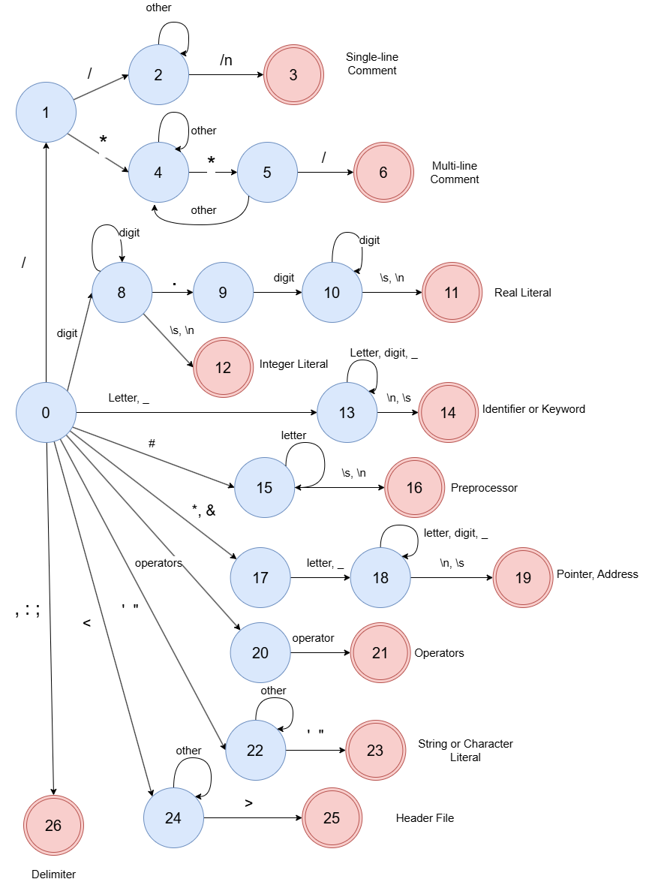

# Lexical Analyzer
Lexical analyzer in C language


## Table of Contents
- [Overview](#overview)
- [Features](#features)
- [Getting Started](#getting-started)
  - [Prerequisites](#prerequisites)
  - [Installation](#installation)
- [Usage](#usage)
- [Example](#example)
  - [Example Input](#input)
  - [Example Output](#output)
- [State mahcine diagram](#state-machine-diagram)
- [Files in the Repository](#files-in-the-repository)
- [License](#license)
- [Contributing](#contributing)
- [Acknowledgments](#acknowledgments)
- [Contact](#contact)


## Overview

This project is a Lexical Analyzer (Lexer) using state machine implemented in JavaScript, designed to analyze C language code. It identifies and categorizes tokens from the input code, such as keywords, operators, literals, comments, preprocessors, pointers and delimiters. The output is displayed in a structured format, making it easy to understand the components of the code.

## Features

- **Token Recognition**: Identifies various tokens including keywords, operators, literals, comments, preprocessors, pointers and delimiters.
- **Scope Tracking**: Maintains scope information for variables and functions.
- **State Machine**: Implemented with designed state machine.
- **Error Handling**: Detects and reports invalid tokens.
- **User -Friendly Interface**: A simple web interface for inputting C code and viewing results.

## Getting Started

### Prerequisites

- A modern web browser (Chrome, Firefox, etc.)
- Basic understanding of C programming language

### Installation

1. Clone the repository:
   ```bash
   git clone https://github.com/Amizaa/Lexical-Analyzer.git
   cd code

## Usage
1. In the text area provided, write or paste your C code.

2. Click the "Analyse the code" button.

3. The output will be displayed in a table format below the input area, showing the tokens identified along with their types, column numbers, line numbers, and scope.

## Example
### Input
You can use the following sample C code to test the analyzer:
```c
#include <stdio.h>

int main() {
    int a = 5;
    float b = 2.5;
    if (a > b) {
        printf("a is greater than b");
    }
    return 0;
}
```
### Output
<table class="table">
                <thead class="thead-dark">
                  <tr>
                    <th scope="col">Token</th>
                    <th scope="col">Type</th>
                    <th scope="col">Column</th>
                    <th scope="col">Line</th>
                    <th scope="col">Scope</th>
                  </tr>
                </thead>
                <tbody id="output"><tr><td>#include</td><td>Preprocessor</td><td>1</td><td>1</td><td>global</td></tr><tr><td>&lt;stdio.h&gt;</td><td>Header File</td><td>10</td><td>1</td><td>global</td></tr><tr><td>int</td><td>Keyword</td><td>1</td><td>3</td><td>global</td></tr><tr><td>main</td><td>Identifier</td><td>5</td><td>3</td><td>global</td></tr><tr><td>(</td><td>Bracket</td><td>9</td><td>3</td><td>global</td></tr><tr><td>)</td><td>Bracket</td><td>10</td><td>3</td><td>global</td></tr><tr><td>{</td><td>Bracket</td><td>12</td><td>3</td><td>1</td></tr><tr><td>int</td><td>Keyword</td><td>5</td><td>4</td><td>1</td></tr><tr><td>a</td><td>Identifier</td><td>9</td><td>4</td><td>1</td></tr><tr><td>=</td><td>Assignment Operator</td><td>11</td><td>4</td><td>1</td></tr><tr><td>5</td><td>Integer Literal</td><td>13</td><td>4</td><td>1</td></tr><tr><td>;</td><td>Delimiter</td><td>14</td><td>4</td><td>1</td></tr><tr><td>float</td><td>Keyword</td><td>5</td><td>5</td><td>1</td></tr><tr><td>b</td><td>Identifier</td><td>11</td><td>5</td><td>1</td></tr><tr><td>=</td><td>Assignment Operator</td><td>13</td><td>5</td><td>1</td></tr><tr><td>2.5</td><td>Real Number Token</td><td>15</td><td>5</td><td>1</td></tr><tr><td>;</td><td>Delimiter</td><td>18</td><td>5</td><td>1</td></tr><tr><td>if</td><td>Keyword</td><td>5</td><td>6</td><td>1</td></tr><tr><td>(</td><td>Bracket</td><td>8</td><td>6</td><td>1</td></tr><tr><td>a</td><td>Identifier</td><td>9</td><td>6</td><td>1</td></tr><tr><td>&gt;</td><td>Comparison Operator</td><td>11</td><td>6</td><td>1</td></tr><tr><td>b</td><td>Identifier</td><td>13</td><td>6</td><td>1</td></tr><tr><td>)</td><td>Bracket</td><td>14</td><td>6</td><td>1</td></tr><tr><td>{</td><td>Bracket</td><td>16</td><td>6</td><td>2</td></tr><tr><td>printf</td><td>Identifier</td><td>9</td><td>7</td><td>2</td></tr><tr><td>(</td><td>Bracket</td><td>15</td><td>7</td><td>2</td></tr><tr><td>"a is greater than b"</td><td>String Literal</td><td>16</td><td>7</td><td>2</td></tr><tr><td>)</td><td>Bracket</td><td>37</td><td>7</td><td>2</td></tr><tr><td>;</td><td>Delimiter</td><td>38</td><td>7</td><td>2</td></tr><tr><td>}</td><td>Bracket</td><td>5</td><td>8</td><td>1</td></tr><tr><td>return</td><td>Keyword</td><td>5</td><td>9</td><td>1</td></tr><tr><td>0</td><td>Integer Literal</td><td>12</td><td>9</td><td>1</td></tr><tr><td>;</td><td>Delimiter</td><td>13</td><td>9</td><td>1</td></tr><tr><td>}</td><td>Bracket</td><td>1</td><td>10</td><td>global</td></tr></tbody>
            </table>

For test and see more example, you can use the **test-code1.txt** and **test-code2.txt** files.

## State Machine Diagram


## Files in the Repository
- LICENSE: Contains the MIT License for the project.
- README.md: This documentation file.
- code/Lexical_Analyser.js: The main JavaScript file that implements the lexical analysis logic.
- code/bootstrap.min.css: The Bootstrap CSS file for styling the web interface.
- code/index.html: The HTML file that provides the user interface for the lexical analyzer.
- test-code1.txt: A sample C code file for testing the analyzer.
- test-code2.txt: Another sample C code file for testing the analyzer.
- lexer-state-machine.png: lexer state machine diagram.

## License
This project is licensed under the MIT License. See the LICENSE file for details.

## Contributing
Contributions are welcome! Please feel free to submit a pull request or open an issue for any suggestions or improvements.

## Acknowledgments
This project was inspired by the need for a better understanding of lexical analysis in programming languages.
Special thanks to the creators of Bootstrap for the UI framework used in this project.

## Contact

For any inquiries or feedback, please reach out to:

- **Your Name** - [Amirreza Noruzi](mailto:amirrezanoruziiii@gmail.com)
- **GitHub**: [Amizaa](https://github.com/Amizaa)

